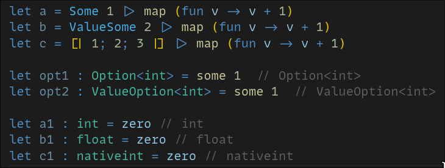
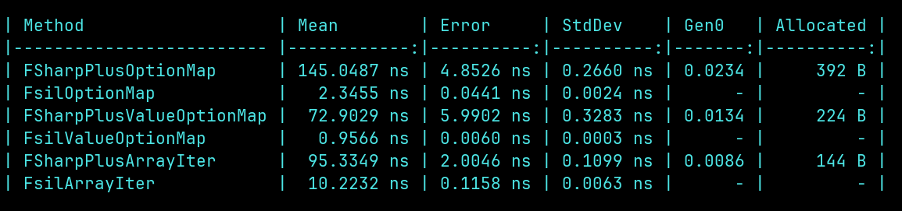

# fsil: F# inline library

<a href="https://www.nuget.org/packages/fsil"></a>

Features:

- a small generic utils library like [FSharpPlus](https://github.com/fsprojects/FSharpPlus)
- all functions are inline and trimmable, won't bloat your binary size: you pay for only what you use
- Fable compatible
- **zero cost**: does not create junk variables or implicit allocations when possible
- uses `[<AutoOpen>]` so all functions are in the global namespace
- just copy the single source file if you want to avoid the dependency (and modify to your preferences)

Example:



[Benchmark comparisons](./src/fsil.benchmarks/Program.fs) to FSharpPlus



####

I love optimizing things in F# and this library makes high-level generic F# a little more feasible without punishing the user performance-wise.
The functions in this library compile down to **exactly the same form as the (optimal) resolved implementation** so `iter f x` to the compiler is **identical** to e.g., `ValueOption.iter f x` or `Array.iter f x`.

Currently this library contains a fairly small set of functions:

`iter`, `iteri`, `iter_len`, `map`, `mapi`, `is_some`, `is_none`, `is_ok`, `some`, `none`, `try_item`, `value`, `len`, `enum`, `enumv`, `default_`, `default_inst`, `default_with`, `zero`, `one`, `print`, `forall`, `exists`, `fold`, `foldi`.

You can also define your own implementations as static members. [here is an example](./src/fsil.test/tests.fs) for `iter` and `map` on a Tree, for documentation just look at the [source code itself](./src/fsil/Library.fs).

```fsharp
type Tree<'T> =
    | Leaf of 'T
    | Node of 'T * Tree<'T> * Tree<'T>

    static member Map(self: Tree<'T>, fn: 'T -> 'U) : Tree<'U> =
        match self with
        | Leaf x -> Leaf(fn x)
        | Node(v, l, r) ->
            let new_l = Tree.Map(l, fn)
            let new_r = Tree.Map(r, fn)
            Node(fn v, new_l, new_r)

    static member Iterate(self: Tree<'T>, fn: 'T -> unit) : unit =
        match self with
        | Leaf x -> fn x
        | Node(v, l, r) ->
            Tree.Iterate(l, fn)
            fn v
            Tree.Iterate(r, fn)

    static member IterateWhile(self: Tree<'T>, fn: 'T -> bool) : bool =
        match self with
        | Leaf x -> fn x
        | Node(v, l, r) ->
            if Tree.IterateWhile(l, fn) then 
                if fn v then 
                    Tree.IterateWhile(r, fn)
                else false
            else false

let tree1 = Leaf 1
let iter = tree1 |> iter (fun v -> print v)
let mapped: Tree<int> = tree1 |> map (fun v -> v + 1)
// these implementations are generated from Iterate/IterateWhile/Map
// so you get them all "for free"
let map_indexed = tree1 |> mapi (fun idx v -> $"elem {idx}:{v}")
let sum: int = tree1 |> fold 0 (fun acc v -> acc + v)
let exists2: bool = tree1 |> exists (fun v -> v = 2)
let all_larger_than_5: bool = tree1 |> forall (fun v -> v > 5)
let find_5: voption<int> = tree1 |> try_find (fun v -> v = 5)
```

or you can extend these definitions to your own general functions
```fsharp
// flattening a list is just binding to id
// this function now works on any collection you can bind
let inline flatten list = list |> bind id 

let flatarray = flatten [|[|1;2;3|];[|4;5;6|]|] // [|1;2;3;4;5;6|]
let flatlist = flatten [[1;2;3];[4;5;6]]  // [1;2;3;4;5;6]
let flatoption = flatten (Some(Some 1)) // Some 1
```

### More

The [Alloy](https://github.com/speakez-llc/Alloy) library extends fsil, adding additional operations, with the same implications. 


Most important remember to have (f#)un! :)
